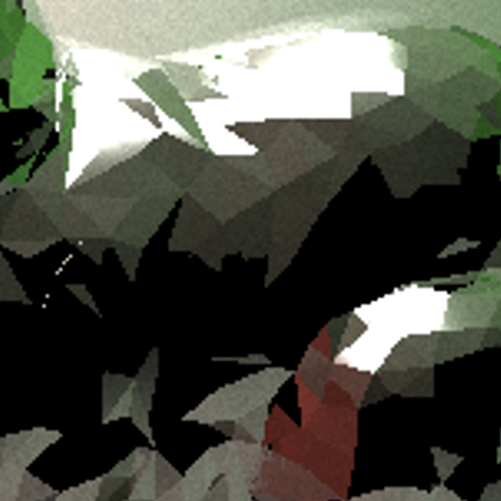
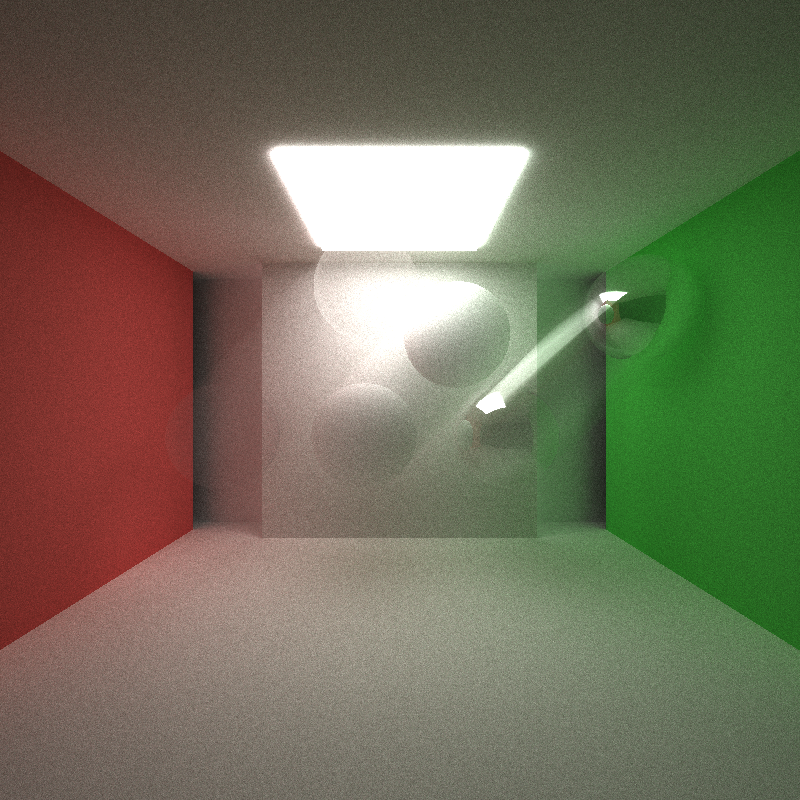
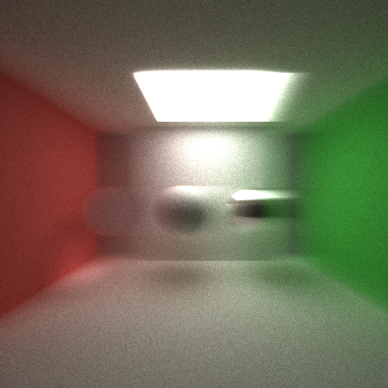

CUDA Path Tracer
================

**University of Pennsylvania, CIS 565: GPU Programming and Architecture, Project 3**

* Yilin Liu
  * [LinkedIn](https://www.linkedin.com/in/yilin-liu-9538ba1a5/)
  * [Personal website](https://www.yilin.games)
* Tested on personal laptop:
  - Windows 10, Intel(R) Core(TM), i7-10750H CPU @ 2.60GHz 2.59 GHz, RTX 2070 Max-Q 8GB

Features
=============
* Shading Kernel with BSDF Evaluation
* Path Termination using Stream Compaction
* Sorting of Paths Segment by Material type
* First Bounce Intersection Cache
* Uniform diffuse
* Perfect Specular Reflective
* Refraction (Fresnel dielectric)
* Stochastic Sampled Antialiasing
* OBJ Mesh Loading using TinyOBJ
* Physically-based depth-of-field
* Motion Blur

Problems of Performing BSDF in a big kernel 
============
CUDA can only launch a finite number of blocks at a time. Some threads end with only a few bounces while others may end with a lot. Therefore, we will waste a lot of threads. 

To solve this problem, we  launch a kernel that traces ONE bounce for every ray in the pool. According to the results, we remove terminated rays from the ray pool with stream compaction. 

Sort by Materials Type 
============
Using Radix Sort by material ID, we can batch rays according to material type. Therefore, we can further parallelize rays and perform intersection testing and shading evaluation in separate kernels. 

First Bounce Intersection Cache
============
We further cache the first bounce intersection and store it in a buffer. Later bounces can use it since this bounce stays the same regardless of iterations. 

Refraction
===========
The refraction effects was implemented using glm's `refract()` function according to Schlick's approximation and Snell's Law. 

| Refraction Ball | Refraction Glass Bottle |
:-------:|:-------:
|||

Anti-aliasing
===========
I jitter the direction of sample ray to reduce the aliasing effects

| With AA | No AA |
:-------:|:-------:
|||
|{:height="800px" width="800px"} | {:height="800px" width="800px"}|

Mesh Loading
===========
I used [tinyObj](https://github.com/tinyobjloader/tinyobjloader) to load obj file. During the loading, we determine the min and max bound of the mesh for bounding box check so that ray does not have to compute intersection with every triangle. 

For each ray, there may be multiple intersection with the mesh. Therefore, we need to select the closest one.

| Bunny | Refraction |
:-------:|:-------:
|||

Depth of Field
============
| Focal Distance: 10, Lens Radius: 0.5 | Focal Distance: 10, Lens Radius: 1.0 |
:-------:|:-------:
|||

Motion Blur
===========
I developed two ways to achieve motion blur in path tracer. The first one works on the camera and it is global based.

| Sphere Motion Blur 1 | Sphere Motion Blur 2 |
:-------:|:-------:
|||

The second one works on certain objects and users can define a direction of the movement. 

| Camera Motion Blur 1 | Camera Motion Blur 2 |
:-------:|:-------:
|||

Analysis
===============

Snapshots
===============

Bloopers
===============
  ||
  |:--:| 
  | *Refraction Fail* |
  
  ||
  |:--:| 
  | *Lonely Cow (Bounding Box Predicate Fail)* |